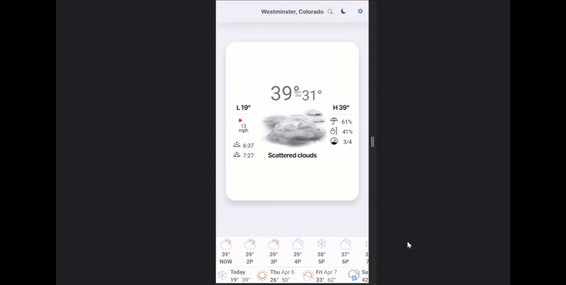

# Weather Station
A full-stack PWA featuring the ability to save and auto-complete location searches.

**Link to project:** https://scary-jacket-fish.cyclic.app/

## How It's Made:

**Tech used** 

Front end built with HTML, CSS, and JavaScript. 

Back end built with Node.js, MongoDB, with packages such as Express, sessions, Mongoose and EJS.

The app uses session data to save the user's data without the need for a login. I experimented with multiple API solutions such as Axios, promises and async/await to aquire data simultaneously to help fuel the dynamic front end experience. The templating language EJS was leveraged to help render the data on the front end in additon to AJAX for a responsive user experience. The horizontally scrollable displays feature CSS grid for smooth scrolling. The custom endpoints I created on the back end allowed me to save and manipulate the data in the MongoDB database for each user.

## Optimizations

Having more time to work on this project I would like to analyze the network traffic in order to increase the speed of the app and add UI/UX improvements such as spacing refinement, slide animations, and a loading animation so users know the site is loading their information. Backend optimizations I would like to make include refinement of the custom endpoints to make them more efficient and secure.

Smaller optimizations I would like to make include:
- Update and enable the dark mode button/functionality
- Add weather data for the added city instead of making user reload
- Enable detection of duplicate cities being entered
- Support beyond US cities
- Deploy to AWS

## Lessons Learned

I firstly learned that planning should be started long before the project is started. I learned that it is important to plan out the project in detail before starting to code. This top-down view will help you to avoid any major roadblocks and will help you to stay on track. I also learned that it is important to keep your code clean and organized. This will help you to avoid any confusion when you come back to the project later on.
